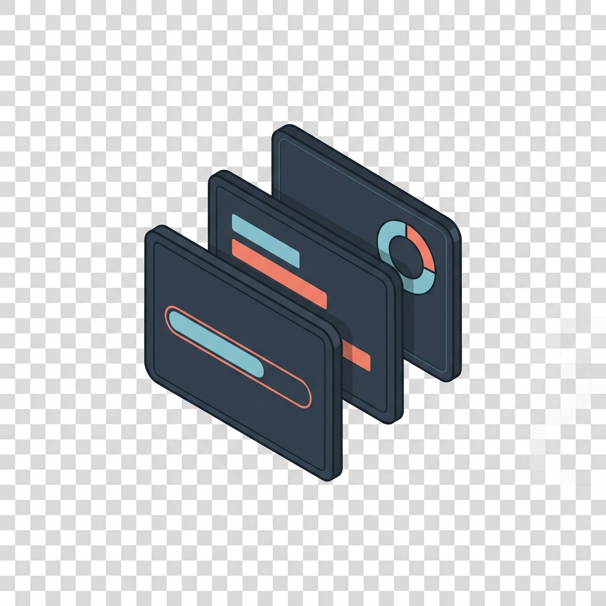

<div align="center">



# SessionUsage

[](https://www.linux.org/)
[](https://swift.org/)
[](https://www.gtk.org/)
[](LICENSE)
[]()
[](https://github.com/MaybeYakuza/codexbar)
[](#)

**See your AI provider usage from the Linux system tray, at a glance.**

A Linux-only tray app forked from CodexBar. It keeps AI provider usage visible from an AppIndicator menu by pairing a native GTK tray process (`SessionUsage`) with the shared Swift backend (`SessionUsageCLI` / `CodexBarCore`).

</div>

## Table of Contents

- [Requirements](#requirements)
- [Quick Start](#quick-start)
- [Commands](#commands)
- [Architecture](#architecture)
- [Providers](#providers)
- [Features](#features)
- [Privacy](#privacy)
- [Credits](#credits)
- [License](#license)

## Requirements
- Linux
- Swift 6
- GTK 3 + Ayatana AppIndicator development packages

## Quick Start

### Install as a desktop app
```bash
sudo apt install libgtk-3-dev libayatana-appindicator3-dev libjson-glib-dev
./Scripts/install_desktop.sh
```

This builds the release binaries, installs a user-local copy into `~/.local/share/sessionusage`, creates a launcher at `~/.local/bin/sessionusage`, registers a desktop entry, and enables login autostart via `~/.config/autostart/sessionusage.desktop`.
It also starts the installed tray app right away. Pass `--no-launch` or `--no-autostart` if you want a lighter install step.

### First-time provider setup
Make sure the provider tools you care about are already installed and signed in. SessionUsage prefers `~/.sessionusage/config.json` and still falls back to the legacy `~/.codexbar/config.json` when migrating an older setup.

### Remove the desktop install
```bash
./Scripts/uninstall_desktop.sh
```

### Build from source
```bash
sudo apt install libgtk-3-dev libayatana-appindicator3-dev libjson-glib-dev
swift build --product SessionUsageCLI --product SessionUsage
./.build/debug/SessionUsage
```

`SessionUsage` looks for `SessionUsageCLI` next to the tray executable first, then falls back to `sessionusage-cli` and the legacy `codexbar`/`CodexBarCLI` names on `PATH`. You can also point it at a custom binary with `SESSIONUSAGE_CLI=/path/to/SessionUsageCLI`.
The tray consumes `SessionUsageCLI --format json`, uses the project icon when available, formats provider summaries as menu sections, refreshes every two minutes, and adds native **Refresh** and **Quit** actions.

## Commands

| Command | Description |
| --- | --- |
| `./Scripts/install_desktop.sh` | Build a user-local release install, create launcher/autostart entries, and start the tray |
| `./Scripts/install_desktop.sh --no-launch --no-autostart` | Install without immediately starting the tray or enabling login autostart |
| `./Scripts/uninstall_desktop.sh` | Remove the local desktop install |
| `./Scripts/compile_and_run.sh` | Build, test, stop any existing dev tray instance, then run the debug tray |
| `swift build --product SessionUsageCLI --product SessionUsage` | Build the CLI and Linux tray targets manually |
| `swift test` | Run the Linux-focused Swift test suite |
| `sessionusage` | Launch the installed tray app after desktop installation |

## Architecture

- `Sources/SessionUsage` contains the native GTK 3 + Ayatana AppIndicator tray shell.
- `Sources/SessionUsageCLI` exposes structured usage output consumed by the tray.
- `Sources/CodexBarCore` contains provider integrations, auth discovery, and usage-fetch logic.
- `Assets/ProviderIcons` contains the provider logos used in the Linux tray menu.
- `Scripts/install_desktop.sh` installs a self-contained user-local app under XDG paths instead of requiring a long terminal command.

## Providers

SessionUsage keeps the shared provider backend from CodexBar, including Linux-relevant support for providers such as Claude, Copilot, Gemini, Cursor, JetBrains AI, Kilo, Kimi, OpenRouter, Augment, Amp, Warp, Ollama, and Abacus AI.

## Features
- Native Linux tray target built with GTK 3 + Ayatana AppIndicator.
- Shared Swift CLI/backend for provider polling and usage formatting.
- Tray refresh, section headers, and project icon support.
- Local-first provider integrations such as CLI, OAuth, and API-token based usage probes.

## Privacy

SessionUsage does **not** crawl your filesystem and **does not make
network requests of its own** — every provider's usage figure comes
from local config the provider's own CLI/desktop app already wrote.

What it reads, only when that provider's integration is enabled:

- Provider cookies, local-storage, and JSONL session logs.
- Auth files written by the provider's first-party CLI (e.g.
  `~/.claude/`, `~/.codeium/`, `~/.cursor/`).
- The provider's CLI binary, when it offers a usage subcommand
  (a few do; SessionUsage shells out, parses, displays).

What it does **not** do:

- It doesn't talk to any provider's API itself.
- It doesn't ship telemetry, analytics, or crash reports anywhere.
- It doesn't keep a remote database of your usage; the tray menu
  is a fresh read every 2 minutes.

If a provider's first-party CLI was already trustworthy enough for you
to install, SessionUsage adds no new exposure — it's reading what they
already wrote to disk.

## Credits
SessionUsage is a Linux-first fork of CodexBar and keeps the shared provider backend while replacing the original macOS app surface with a GTK tray app. It is also inspired by [ccusage](https://github.com/ryoppippi/ccusage) (MIT), specifically the cost usage tracking.

## License

MIT — see [LICENSE](LICENSE).
